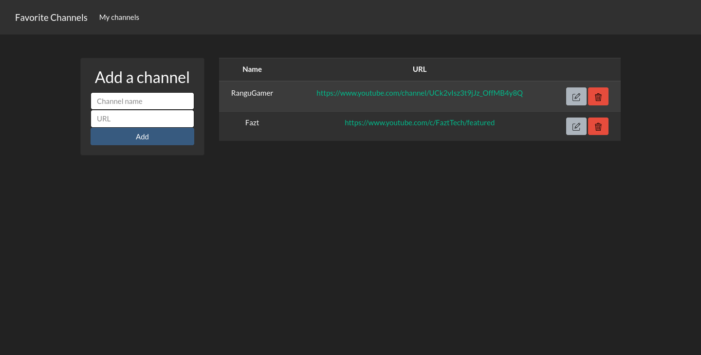

# Favotire channels

A CRUD example using MongoDB and NodeJS

## How to run

1. Clone the repo
2. Run `npm i`
3. Create a .env file
4. Add to .env file `PORT` and `MONGO_URI` var
5. Run `npm run start`

## Credits
Trash icon made by [bqlqn](https://www.flaticon.com/authors/bqlqn) from [Flaticon](https://www.flaticon.com/)

Edit icon made by [Kiranshastry](https://www.flaticon.com/authors/kiranshastry) from [Flaticon](https://www.flaticon.com/)